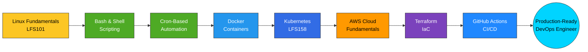

<div align="center">

```
+-[ali-faizan@github]--+     OS       : DevOps Engineer (in training)
|  > _                 |     Host     : Punjab University - BSIT '28
|                      |     Kernel   : Linux (LFS101 certified)
|   [#]   [#]   [#]    |     Uptime   : since April 2026 (~5 months)
|                      |     Shell    : bash 5.x
|         (*)          |     DE       : cron + systemd habits
+-----------------------+    CPU      : Critical Thinking (8 cores)
                              Memory   : 3.53 / 4.00 CGPA
                              Packages : Docker, K8s, Terraform, AWS, CI/CD
```


<br>

[](https://github.com/AliFaizan-git)

[](mailto:muhammadaliii98989@gmail.com)
[](https://www.linkedin.com/in/alifaizan11)
[](https://www.credly.com/users/ali-faizan.73eaccb4)

</div>

<br>

## `$ git log --oneline --graph --decorate`

```
* 7f3a9c2 (HEAD -> main) feat: certified in Kubernetes fundamentals (LFS158)
* 4e18b6d feat: certified in AWS fundamentals — Simplilearn
* 9c2d451 feat: certified in DevOps & Site Reliability Engineering (LFS162)
* a83f120 feat: certified in Linux administration (LFS101)
* 6b09e77 build: shipped System Health Monitor — Bash monitoring toolkit
* 2d84f01 feat: learned Docker — single & multi-stage builds, image sizing
* 88e3a9c feat: learned cron-based job scheduling & automation
* c471de0 feat: learned shell scripting fundamentals
* 5a90c33 init: began self-driven DevOps learning track
* 1f0a2b8 (tag: v1.0) job: Backend Engineer Intern @ DevelopersHub — MERN stack
* 0c58e19 edu: started BSIT @ Punjab University
```

<br>

## `$ man ali-faizan`

```
ALI-FAIZAN(1)                  User Manual                  ALI-FAIZAN(1)

NAME
       ali-faizan — DevOps engineer in training, backend developer,
       and full-time explainer-of-things

SYNOPSIS
       ali-faizan [--role=junior-devops] [--location=Pakistan]
                   [--teaching=true] [--status=building]

DESCRIPTION
       A 5th-semester BSIT student (Punjab University, CGPA 3.53/4.00)
       who spent the last several months turning curiosity about
       "how production actually stays up" into a real, hands-on
       DevOps skill set — Linux, Bash, Docker, Kubernetes, and cloud
       fundamentals — backed by Linux Foundation and AWS certification.

       Also works as a Programming Lecturer & Teaching Assistant,
       which mostly means explaining recursion to confused sophomores
       and secretly enjoying it.

SEE ALSO
       docker(1), kubectl(1), terraform(1), git(1), coffee(1)
```

<br>

## `$ cat learning-pipeline.yaml`



<br>

## `$ kubectl get skills -n ali-faizan -o wide`

```
NAME                        READY   STATUS      RESTARTS   AGE
linux-fundamentals          1/1     Running     0          5mo
shell-scripting              1/1     Running     0          5mo
cron-automation               1/1     Running     0          5mo
docker-containers              1/1     Running     0          4mo
system-health-monitor            1/1     Running     0          3mo
kubernetes-orchestration            1/1     Running     0          1w
aws-cloud-fundamentals                 1/1     Running     0          1w
terraform-iac                             0/1     Pending     0          2d
github-actions-cicd                          0/1     Pending     0          2d
```

<br>

## `$ cat /proc/tech-stack`

<table>
<tr>
<td valign="top" width="50%">

**Cloud & Infrastructure**
```
AWS            ■■■■□  Fundamentals certified
Docker         ■■■■■  Multi-stage builds, optimization
Kubernetes     ■■■□□  Core concepts certified
Terraform      ■■□□□  Learning IaC
Linux          ■■■■■  Certified administrator
```

</td>
<td valign="top" width="50%">

**Backend & Data**
```
Node.js        ■■■■□  Production experience
Express.js     ■■■■□  REST APIs, middleware
MongoDB        ■■■□□  Schema design, queries
Redis / Bull.js ■■■□□  Queues & caching
React / Vite   ■■■□□  Frontend fundamentals
```

</td>
</tr>
<tr>
<td valign="top" width="50%">

**Automation & CI/CD**
```
Bash Scripting     ■■■■■  Toolkit-grade
Cron               ■■■■■  Scheduling & reliability
GitHub Actions     ■■□□□  Learning pipelines
Git / GitHub       ■■■■■  Daily workflow
```

</td>
<td valign="top" width="50%">

**Monitoring & Reliability**
```
Logging            ■■■■■  Structured, rotated
Alerting           ■■■■□  Threshold-based
SRE Principles     ■■■□□  Certified fundamentals
Networking         ■■■□□  Core concepts
```

</td>
</tr>
</table>

<br>

## `$ ls -la ./certifications/`

| Credential | Issuer | Earned | Verify |
|---|---|---|---|
| 🐧 Introduction to Linux — LFS101 | The Linux Foundation | Sept 2026 | [→ Verify](https://www.credly.com/badges/8bc88b2c-1f8c-4154-9774-c83fb4af9491/public_url) |
| ☸️ Introduction to Kubernetes — LFS158 | The Linux Foundation | Sept 2026 | [→ Verify](https://www.credly.com/badges/b6a020f4-a473-4e98-aa4f-f2a17a757b7d/public_url) |
| 🔁 Intro to DevOps & Site Reliability Engineering — LFS162 | The Linux Foundation | Sept 2026 | [→ Verify](https://www.credly.com/badges/5616e72c-055a-4a12-9e35-26fae8611042/public_url) |
| ☁️ Fundamentals of DevOps on AWS | Simplilearn | Sept 2026 | [→ Verify](https://www.simplilearn.com/skillup-certificate-landing?token=eyJjb3Vyc2VfaWQiOiIzNzQxIiwiY2VydGlmaWNhdGVfdXJsIjoiaHR0cHM6XC9cL2NlcnRpZmljYXRlcy5zaW1wbGljZG4ubmV0XC9zaGFyZVwvMTA3MDM5NTFfMTEwNTk3MzBfMTc4ODc5MDcyODE0NS5wbmciLCJ1c2VybmFtZSI6IkFsaSBGYWl6YW4ifQ%3D%3D) |

> ⚠️ Badge ↔ credential mapping above follows the order you sent them — worth a quick double-check against your Credly wallet before this goes live.

Full wallet → [credly.com/users/ali-faizan.73eaccb4](https://www.credly.com/users/ali-faizan.73eaccb4)

<br>

## `$ ./deploy.sh --project=flagship`

**System Health Monitor** — a dependency-free Bash toolkit built from scratch, not a tutorial clone:

```
┌─────────────┐    ┌─────────────┐    ┌─────────────┐    ┌─────────────┐
│  Collect    │ →  │  Threshold  │ →  │  Structured │ →  │   Cron      │
│  Metrics    │    │  Alerting   │    │  Logging    │    │  Scheduling │
│ CPU/MEM/DSK │    │ Spike/Fail  │    │ Rotate+Keep │    │ Hands-off   │
└─────────────┘    └─────────────┘    └─────────────┘    └─────────────┘
```

ShellCheck-verified, zero warnings → [`github.com/AliFaizan-git/Devops-Project_1`](https://github.com/AliFaizan-git/Devops-Project_1)

<br>

## `$ find ./projects -type d`

| Project | What it covers | Repo |
|---|---|---|
| Docker Labs | Single & multi-stage Dockerfiles, image size/layer optimization | [→](https://github.com/AliFaizan-git/Docker_Labs) |
| Shell Scripting Projects | Real-world Linux automation scenarios | [→](https://github.com/AliFaizan-git/Shell_Scriptong-Projects) |
| Cron Labs | Job scheduling, logging, automation reliability | [→](https://github.com/AliFaizan-git/CRON_LABS) |
| Linux Learning Projects | Core commands & system administration | [→](https://github.com/AliFaizan-git/Linux-Learning-Projects) |

<br>

## `$ watch -n1 git contribution --animate`

<div align="center">


</div>

> Live and actually moving — a snake eats through your real commit graph, regenerated daily by a GitHub Action. Setup file included below; nothing to build, just drop it in.

<br>

---

<div align="center">

```
ALI-FAIZAN(1)                 See Also                 ALI-FAIZAN(1)

  Email      muhammadaliii98989@gmail.com
  LinkedIn   linkedin.com/in/alifaizan11
  Credly     credly.com/users/ali-faizan.73eaccb4
  Status     Open to Junior DevOps Engineer internships
```

*"The best infrastructure is the one nobody has to think about — I'd like to help build that kind."*

</div>
