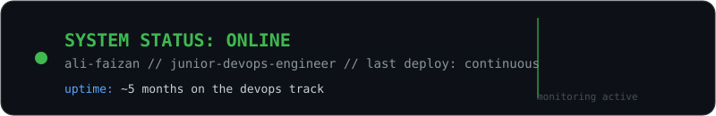
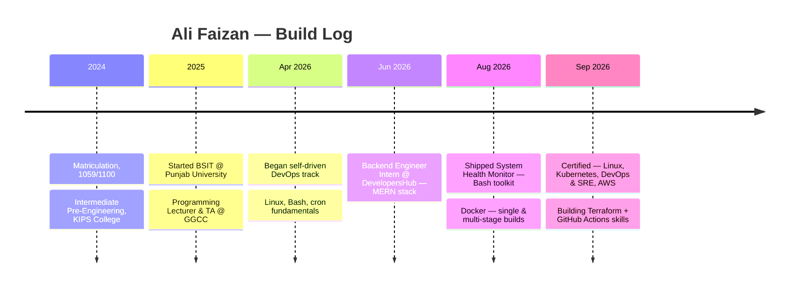
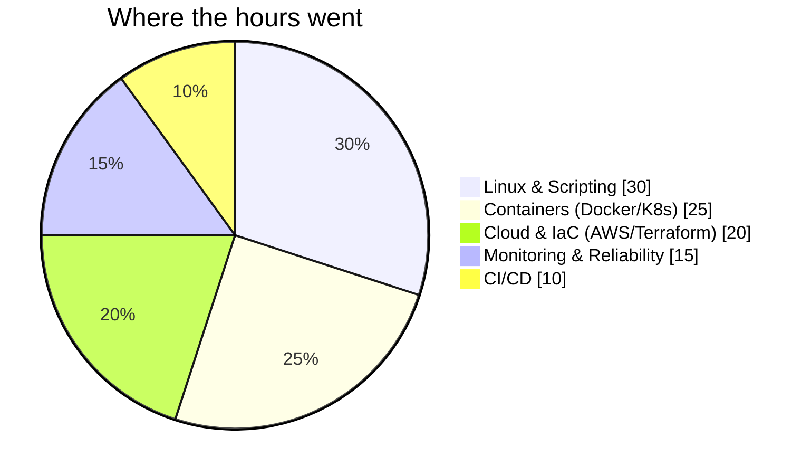

  

### `Junior DevOps Engineer` · `Backend Developer (MERN)` · `Punjab University — BSIT`

 

## 📊 Live Metrics — Skill Proficiency

Self-assessed proficiency, not a benchmark — Linux/Kubernetes/AWS backed by certification, Terraform/CI-CD actively in progress.

 

## ⚙️ Deployment Pipeline

 

## 🕒 Career Timeline

 

## 🧭 Skill Focus Areas

 

## 🏅 Certifications

<table>
<tr><td width="60">🐧</td><td><b>Introduction to Linux — LFS101</b> The Linux Foundation · Sept 2026</td><td><a href="https://www.credly.com/badges/8bc88b2c-1f8c-4154-9774-c83fb4af9491/public_url">Verify →</a></td></tr>
<tr><td width="60">☸️</td><td><b>Introduction to Kubernetes — LFS158</b> The Linux Foundation · Sept 2026</td><td><a href="https://www.credly.com/badges/b6a020f4-a473-4e98-aa4f-f2a17a757b7d/public_url">Verify →</a></td></tr>
<tr><td width="60">🔁</td><td><b>DevOps & Site Reliability Engineering — LFS162</b> The Linux Foundation · Sept 2026</td><td><a href="https://www.credly.com/badges/5616e72c-055a-4a12-9e35-26fae8611042/public_url">Verify →</a></td></tr>
<tr><td width="60">☁️</td><td><b>Fundamentals of DevOps on AWS</b> Simplilearn · Sept 2026</td><td><a href="https://www.simplilearn.com/skillup-certificate-landing?token=eyJjb3Vyc2VfaWQiOiIzNzQxIiwiY2VydGlmaWNhdGVfdXJsIjoiaHR0cHM6XC9cL2NlcnRpZmljYXRlcy5zaW1wbGljZG4ubmV0XC9zaGFyZVwvMTA3MDM5NTFfMTEwNTk3MzBfMTc4ODc5MDcyODE0NS5wbmciLCJ1c2VybmFtZSI6IkFsaSBGYWl6YW4ifQ%3D%3D">Verify →</a></td></tr>
</table>

 

##  Project

**System Health Monitor** — a dependency-free Bash toolkit, ShellCheck-verified with zero warnings:

| Stage | What it does |
|---|---|
| Collect | Tracks CPU, memory, disk, and process-level metrics continuously |
| Alert | Threshold-based alerting flags spikes and failures without manual checks |
| Log | Structured logging with rotation and retention |
| Report | Automated report generation for at-a-glance diagnostics |
| Schedule | Runs hands-off via cron, mirroring production monitoring agents |

→ [`github.com/AliFaizan-git/Devops-Project_1`](https://github.com/AliFaizan-git/Devops-Project_1)

 

## 🟢 Services Running

| Service | Status | Repo |
|---|---|---|
| `docker-labs` | 🟢 running | [→](https://github.com/AliFaizan-git/Docker_Labs) |
| `shell-scripting-projects` | 🟢 running | [→](https://github.com/AliFaizan-git/Shell_Scriptong-Projects) |
| `cron-labs` | 🟢 running | [→](https://github.com/AliFaizan-git/CRON_LABS) |
| `linux-learning-projects` | 🟢 running | [→](https://github.com/AliFaizan-git/Linux-Learning-Projects) |

 

## 📈 Commit Activity

Regenerated daily via GitHub Actions — see <code>.github/workflows/snake.yml</code>

 

---

**📟 On-Call**

| | |
|---|---|
| Email | muhammadaliii98989@gmail.com |
| LinkedIn | linkedin.com/in/alifaizan11 |
| Credly | credly.com/users/ali-faizan.73eaccb4 |
| Status | 🟢 Open to Junior DevOps Engineer internships |

*"The best infrastructure is the one nobody has to think about — I'd like to help build that kind."*

